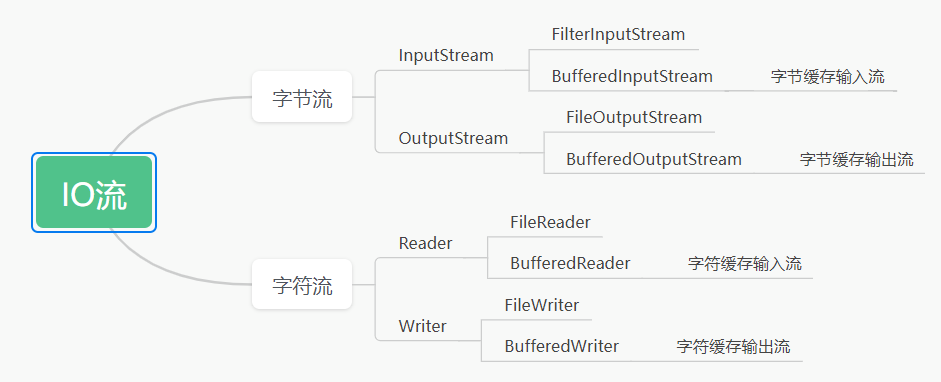

- 字节缓冲流
```
字节缓冲输入流:BufferedInputStream,提高普通字节输入流读取数据的性能
字节缓冲输出流:BufferedOutputStream,提高普通字节输出流读取数据的性能
```
- 字节缓冲流性能优化原理
```
字节缓冲输入流自带了8KB的缓冲池，之后可以直接从缓冲池读取数据，提高性能
字节缓冲输出流自带了8KB的缓冲池，数据直接写到缓冲池中
```

- 字符缓冲流
```
字符缓冲输入流:BufferedReader,提高普通字符输入流读取数据的性能，新增按行读取功能
字符缓冲输出流:BufferedWriter,提高普通字符输出流读取数据的性能，新增换行功能
```